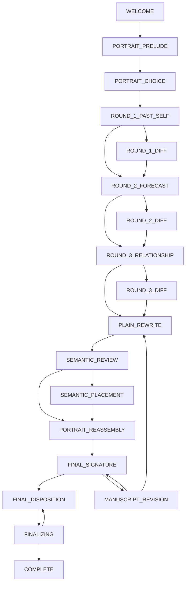

# Stage 4 implementation notes

This document describes the implemented Stage 4 machine. Canonical Domain,
Runtime, Provenance, Finalization, Naming, Application and State Machine
Contracts remain authoritative.

## State graph

`SEMANTIC_REVIEW` is a deterministic integrity branch inside the same atomic
Plain/Semantic commit. No recoverable snapshot can contain a new plain revision
without its bound drift, fragments, restoration outcomes and receipts.

## State policy table

The canonical event lists are `STAGE_DESCRIPTORS` in the Domain layer.

| State | Kind | Entry action | Success | Failure | Timeout | Refresh |
| --- | --- | --- | --- | --- | --- | --- |
| WELCOME | user_interactive | showWelcome | PORTRAIT_PRELUDE | WELCOME | none | restore_interactive |
| PORTRAIT_PRELUDE | user_interactive | loadPortraitPrelude | PORTRAIT_CHOICE | PORTRAIT_PRELUDE | none | restore_interactive |
| PORTRAIT_CHOICE | user_interactive | prepareInitialPortraitChoice | ROUND_1_PAST_SELF | PORTRAIT_CHOICE | none | restore_interactive |
| ROUND_1_PAST_SELF | user_interactive | prepareRound1 | ROUND_1_DIFF or ROUND_2_FORECAST | same state | operation typed failure | invalidate operation, restore input |
| ROUND_1_DIFF | user_interactive | showRound1Diff | ROUND_2_FORECAST | same state | none | restore_interactive |
| ROUND_2_FORECAST | user_interactive | prepareRound2 | ROUND_2_DIFF or ROUND_3_RELATIONSHIP | same state | operation typed failure | invalidate operation, restore input |
| ROUND_2_DIFF | user_interactive | showRound2Diff | ROUND_3_RELATIONSHIP | same state | none | restore_interactive |
| ROUND_3_RELATIONSHIP | user_interactive | prepareRound3 | ROUND_3_DIFF or PLAIN_REWRITE | same state | operation typed failure | invalidate operation, restore input |
| ROUND_3_DIFF | user_interactive | showRound3Diff | PLAIN_REWRITE | same state | none | restore_interactive |
| MANUSCRIPT_REVISION | user_interactive | checkpointAndHideSignatureReview | PLAIN_REWRITE or FINAL_SIGNATURE | same state | none | restore checkpoint |
| PLAIN_REWRITE | system_transient | startPlainSemanticOrchestration | SEMANTIC_REVIEW | PLAIN_REWRITE | operation typed failure | invalidate then deterministic retry only in Mock mode |
| SEMANTIC_REVIEW | system_transient | verifyCommittedPlainSemanticBundle | SEMANTIC_PLACEMENT or PORTRAIT_REASSEMBLY | PLAIN_REWRITE | transactional, no partial state | retry whole bundle only |
| SEMANTIC_PLACEMENT | user_interactive | startOrResumePlacementBatch | PORTRAIT_REASSEMBLY | same state | operation typed failure | invalidate operation, restore batch |
| PORTRAIT_REASSEMBLY | user_interactive | preparePortraitComparison | FINAL_SIGNATURE | same state | operation typed failure | invalidate operation, restore choice |
| FINAL_SIGNATURE | user_interactive | showReadOnlySignatureReview | FINAL_DISPOSITION or MANUSCRIPT_REVISION | same state | unavailable | invalidate operation, preserve attempts |
| FINAL_DISPOSITION | user_interactive | prepareDisposition | FINALIZING | same state | none | restore_interactive |
| FINALIZING | system_transient | startAtomicEnvelopePersistence | COMPLETE | FINAL_DISPOSITION | rollback | retry if COMPLETE transaction absent |
| COMPLETE | terminal | showReadOnlyEnvelope | none | none | none | restore_read_only |

## Guards and progression

- Stage/event legality comes only from `STAGE_DESCRIPTORS`; COMPLETE accepts no
  Session event. `START_NEW_SESSION` is an application command.
- Each round accepts one main response and at most one clarification. The
  explicit no-clarification event starts the same complete Round Analysis
  operation; there is no synthetic `ADVANCE` event.
- Only an accepted, current-revision Diff changes canonical text. A rejection
  preserves text and records the unresolved disagreement. A no-change bundle
  advances without creating a pending Diff.
- Every result must match the active operation's operation, request, stage,
  stage instance, input fingerprint, capability, content and revision binding.
  Late, duplicate, cancelled and stale results do not change business state.
- Margin-note and bouquet placements confirm immediately. Plain restoration
  remains unresolved until its exact frozen proposal passes revision,
  anchor/source-hash and proposal-hash validation and is explicitly confirmed.
- Placement is disabled while the single consistency check is running. Success
  replaces the prior placement drift with one current drift and cannot add or
  remove fragments; failure restores the batch to a retryable in-progress state.
- FINAL_SIGNATURE is read-only. `signed`/`declined` only come from a validated
  service result; technical failure is `unavailable`; a pre-request skip is
  `not_requested`; future Charlie remains `blank`.
- Return-to-manuscript follows the frozen Domain checkpoint semantics:
  cancellation or NFC no-change restores the same-bound checkpoint and attempt
  budget; an actual revision discards it and invalidates all revision-bound
  plain/semantic/placement/signature results.
- `evaluateFinalization` is invoked by the reducer only for
  `CHOOSE_DISPOSITION`, before entering FINALIZING, and only when no operation
  is active. `isFinalizable` remains its thin boolean wrapper.

## Persistence, privacy, concurrency and recovery

IndexedDB uses three stores (`sessions`, `sidecars`, `idempotency`) and one
read-write transaction per business transition. The Session aggregate already
contains revision history, receipts and provenance, so these values commit with
the matching `StateTransitionIdempotencyRecord`. An abort leaves none of the
three writes visible. FinalEnvelope, its idempotency record and COMPLETE state
use that same boundary.

Full round responses and clarifications are held only in the private local
sidecar. Structured principles live in SessionState. Runtime operation metadata
and budget usage are local persisted metadata. Analytics consent/data is not
part of the experience aggregate or private-input store. This stage performs no
server persistence and does not use localStorage for Domain data.

Web Locks serialize same-session writes when available and BroadcastChannel
announces committed revisions. Without Web Locks, every commit checks both the
previous owner token and expected state revision; a conflict is explicit and
never overwrites silently.

Unfinished sessions expire 24 hours after the latest successful save and are
deleted on cleanup. A recovery validates integrity, current Session Schema and
all content identity fields. It always clears the old ActiveOperation and
rotates the stage instance. A pending signature becomes an explainable
`unavailable/interrupted_by_refresh` snapshot without resetting its attempt
count. Mock Plain/Semantic work may be deterministically resumed; live work is
never automatically reissued. An uncommitted FINALIZING snapshot returns to
FINAL_DISPOSITION; a committed COMPLETE snapshot is read-only.

There is no Session Schema change in Stage 4, so no migration is registered.
Unknown future or breaking unfinished snapshots and corrupt snapshots are
rejected explicitly. The existing recovery registry supports explicit
same-major migrations and registered legacy COMPLETE read-only decoders; there
is no implicit compatibility or generic `schemaVersion` field.
